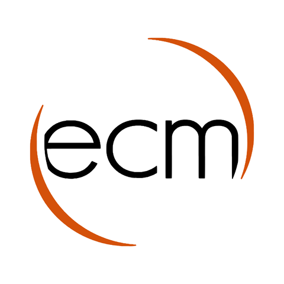
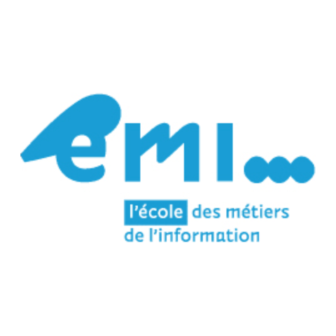
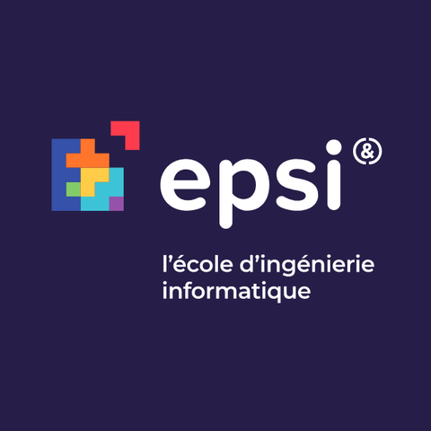
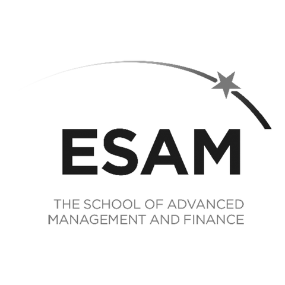
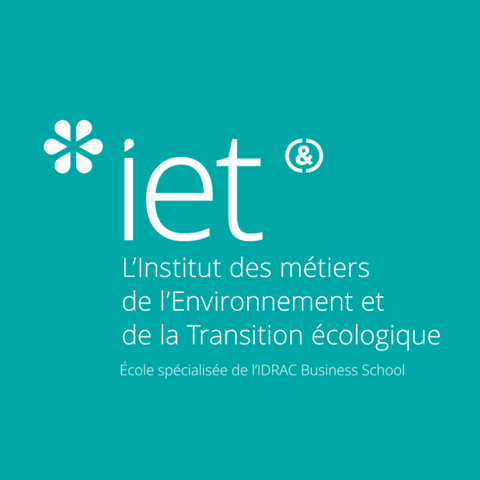
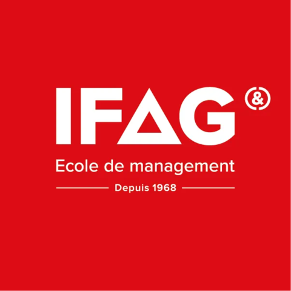
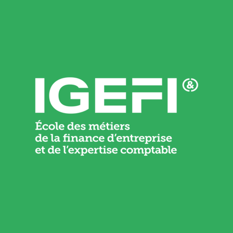
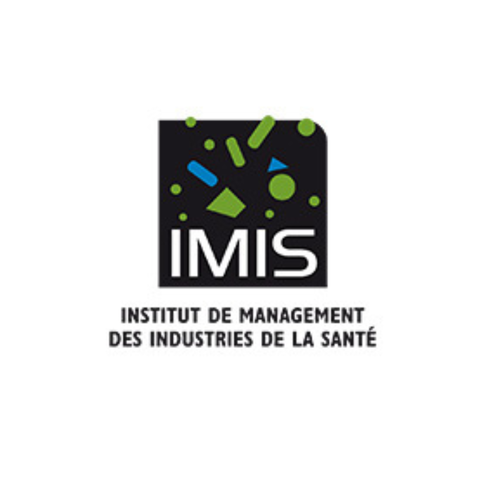
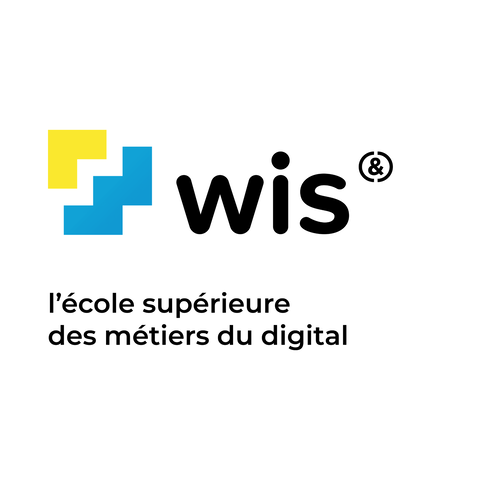

<p align="center">A <strong>wrapper</strong> for interacting with <strong>Wigor services.</strong></p>
<p align="center">
  <a href="https://www.npmjs.com/package/@studentsphere/linkgor"></a>
  <a href="https://www.npmjs.com/package/@studentsphere/linkgor"></a>
  <a href="https://www.typescriptlang.org/"></a>
</p>

`linkgor` is a modern, lightweight TypeScript wrapper designed to interact with WigorServices portals. It is exclusively compatible with schools from the **[Compétences & Développement (C&D)](https://www.competences-developpement.com)** and **[IGENSIA Education](https://www.igensia-education.fr)** groups.

- 🔑 **CAS Authentication**
- 📅 **Planning Retrieval**
- 👤 **Profile Parsing**
- 🪶 **Zero Dependencies**
- ⚡ **TypeScript First**
- 🏫 **Multi-School Support**

## Installation

### With npm
```bash
npm install @studentsphere/linkgor
```

### With pnpm
```bash
pnpm add @studentsphere/linkgor
```

### With yarn
```bash
yarn add @studentsphere/linkgor
```

### With bun
```bash
bun add @studentsphere/linkgor
```

## Documentation

For more information, please refer to the documentation at [linkgor.studentsphere.app/docs](https://linkgor.studentsphere.app/docs).

## Supported Schools

<table border="0">
  <tr>
    <td align="center" valign="top" width="20%">
      <br>
      <sub>3A</sub>
    </td>
    <td align="center" valign="top" width="20%">
      <br>
      <sub>American Business College</sub>
    </td>
    <td align="center" valign="top" width="20%">
      <br>
      <sub>Business Science Institute</sub>
    </td>
    <td align="center" valign="top" width="20%">
      <br>
      <sub>CNVA</sub>
    </td>
    <td align="center" valign="top" width="20%">
      <br>
      <sub>ECM</sub>
    </td>
  </tr>
  <tr>
    <td align="center" valign="top">
      <br>
      <sub>EMI</sub>
    </td>
    <td align="center" valign="top">
      <br>
      <sub>EPSI</sub>
    </td>
    <td align="center" valign="top">
      <br>
      <sub>ESA</sub>
    </td>
    <td align="center" valign="top">
      <br>
      <sub>ESAIL</sub>
    </td>
    <td align="center" valign="top">
      <br>
      <sub>ESAM</sub>
    </td>
  </tr>
  <tr>
    <td align="center" valign="top">
      <br>
      <sub>ICD Business School</sub>
    </td>
    <td align="center" valign="top">
      <br>
      <sub>ICL</sub>
    </td>
    <td align="center" valign="top">
      <br>
      <sub>IDRAC Business School</sub>
    </td>
    <td align="center" valign="top">
      <br>
      <sub>IEFT</sub>
    </td>
    <td align="center" valign="top">
      <br>
      <sub>IET</sub>
    </td>
  </tr>
  <tr>
    <td align="center" valign="top">
      <br>
      <sub>IFAG</sub>
    </td>
    <td align="center" valign="top">
      <br>
      <sub>IGEFI</sub>
    </td>
    <td align="center" valign="top">
      <br>
      <sub>IGENSIA RH</sub>
    </td>
    <td align="center" valign="top">
      <br>
      <sub>IHEDREA</sub>
    </td>
    <td align="center" valign="top">
      <br>
      <sub>ILERI</sub>
    </td>
  </tr>
  <tr>
    <td align="center" valign="top">
      <br>
      <sub>IMIS</sub>
    </td>
    <td align="center" valign="top">
      <br>
      <sub>IMSI</sub>
    </td>
    <td align="center" valign="top">
      <br>
      <sub>IPI</sub>
    </td>
    <td align="center" valign="top">
      <br>
      <sub>ISCPA</sub>
    </td>
    <td align="center" valign="top">
      <br>
      <sub>ISMM</sub>
    </td>
  </tr>
  <tr>
    <td align="center" valign="top">
      <br>
      <sub>SUP DE COM</sub>
    </td>
    <td align="center" valign="top">
      <br>
      <sub>VIVA MUNDI</sub>
    </td>
    <td align="center" valign="top">
      <br>
      <sub>WIS</sub>
    </td>
    <td width="20%"></td>
    <td width="20%"></td>
  </tr>
</table>

## Contributing
Please see [CONTRIBUTING](/CONTRIBUTING.md) in the repository for guidelines and best practices.

## License
`linkgor` is licensed under the [GNU General Public License v3.0](https://choosealicense.com/licenses/gpl-3.0/), allowing you to use, modify, and distribute it for both commercial and non-commercial purposes, provided that the license terms are respected. See the [LICENSE](/LICENSE) file for more details.

## Legalities

> [!CAUTION]
> **LEGAL DISCLAIMER**
>
> This project, `@studentsphere/linkgor`, is an independent open-source tool. It is **not affiliated with, authorized, maintained, sponsored, or endorsed** by the **[Compétences & Développement (C&D)](https://www.competences-developpement.com)** group, **[IGENSIA Education](https://www.igensia-education.fr)**, or the developers of the **[WigorServices](http://wigorservices.net)** platform.
>
> 1. **Intellectual Property:** All trademarks, logos, and brand names are the property of their respective owners. Their mention here is strictly for identification and compatibility purposes and does not imply any association.
> 2. **Responsible Use:** This tool is provided strictly to facilitate interoperability. The authors decline any liability for misuse, illegal activities, or malicious acts committed by users. You are solely responsible for ensuring your use of this tool complies with applicable laws and terms of service. 
> 3. **No Warranty:** The software is provided "as is", without warranty of any kind. The developer assumes no liability for account suspensions, access blocks, or any legal actions taken by the aforementioned groups resulting from the use of this tool.
>
> **By using this package, you acknowledge and agree to these terms in full.**

This project is meant to help users interact with their own data while respecting French software laws ([Article L.122-6-1 of the French Intellectual Property Code](https://www.legifrance.gouv.fr/codes/article_lc/LEGIARTI000044365559)). It only does what’s needed to make the software work together with other tools, without copying, sharing, or changing the original software. This analysis is limited to what’s needed for interoperability and isn’t used for anything else.

For any legal questions or concerns regarding this project, contact: [contact@studentsphere.app](mailto:contact@studentsphere.app?subject=%5BStudentSphere%5D%20Legal%20Inquiry%20about%20Linkgor).
