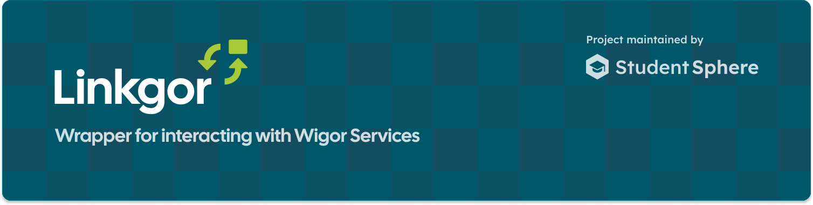

<p align="center">A <strong>wrapper</strong> for interacting with <strong>Wigor services.</strong></p>
<p align="center">
  
  
  </img>
</p>

## Installation


### With pnpm
```bash
pnpm add @studentsphere/linkgor
```

## Documentation


## Contributing
Please see [CONTRIBUTING](/CONTRIBUTING.md) in the repository for guidelines and best practices.

## License
Blocksnote is licensed under the [MIT License](https://choosealicense.com/licenses/mit/), allowing you to use, modify, and distribute it for both commercial and non-commercial purposes, provided that the license terms are respected. See the [LICENSE](/LICENSE) file for more details.

## Legalities
This project is meant to help users interact with their own data while respecting French software laws ([Article L.122-6-1 of the French Intellectual Property Code](https://www.legifrance.gouv.fr/codes/article_lc/LEGIARTI000044365559)). It only does what’s needed to make the software work together with other tools, without copying, sharing, or changing the original software. This analysis is limited to what’s needed for interoperability and isn’t used for anything else.

For any legal questions or concerns regarding this project, contact: [raphael@papillon.bzh](mailto:raphael@papillon.bzh?subject=%5BBlocksHub%5D%20Legal%20Inquiry%20about%20Blocksnote).

## Credits
- [@noble/ciphers](https://github.com/paulmillr/noble-ciphers) - [MIT License](https://choosealicense.com/licenses/mit/)
- [@noble/hashes](https://github.com/paulmillr/noble-hashes) - [MIT License](https://choosealicense.com/licenses/mit/)
- [micro-rsa-dsa-dh](https://github.com/paulmillr/micro-rsa-dsa-dh) - [MIT License](https://choosealicense.com/licenses/mit/)